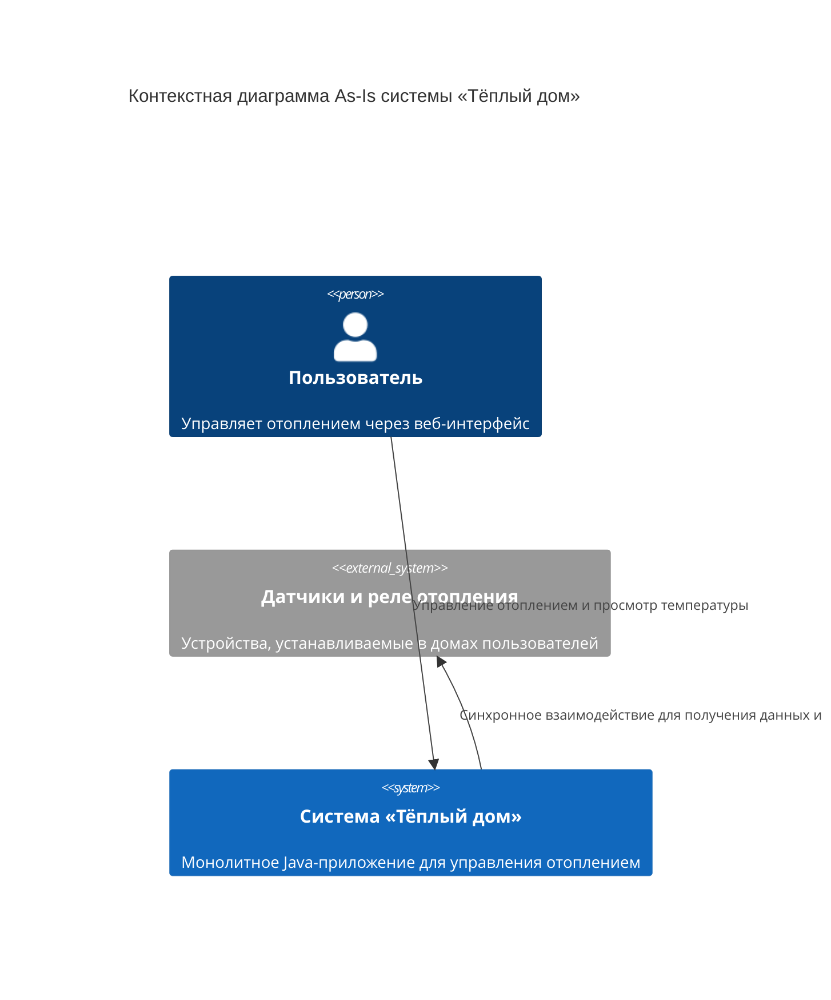
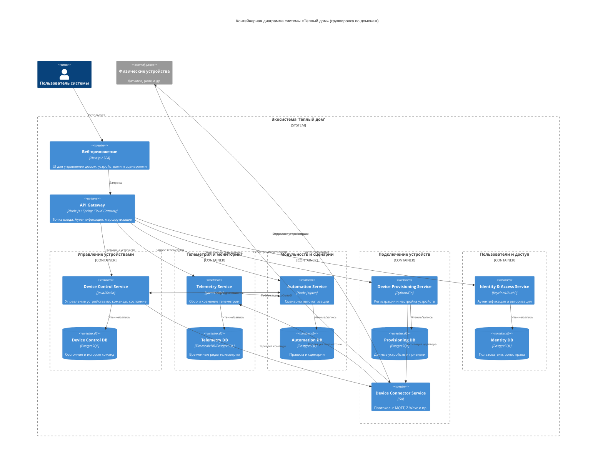
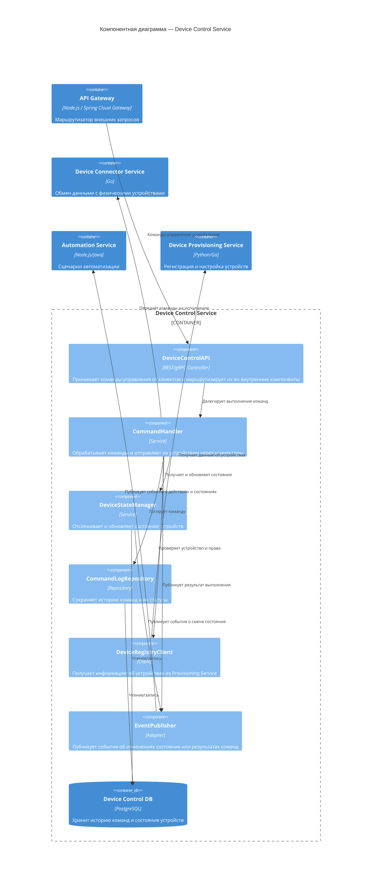
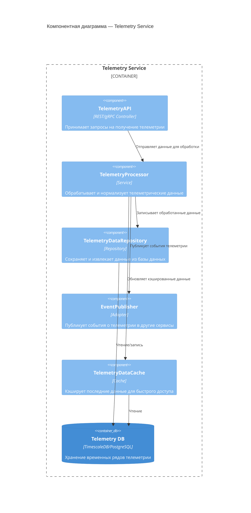
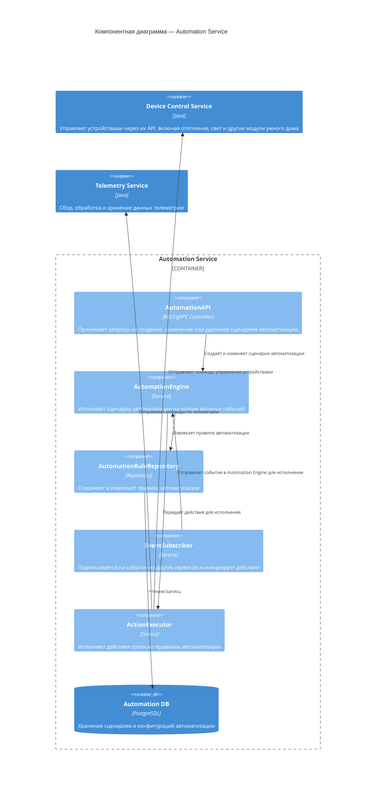
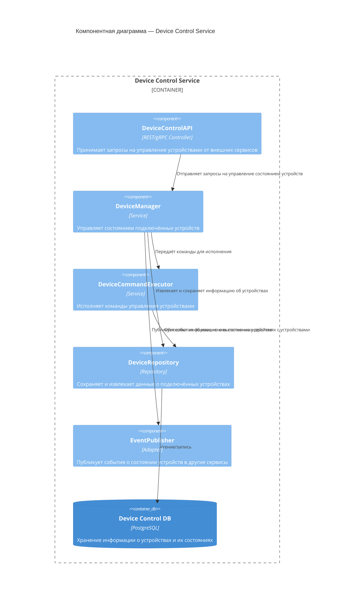
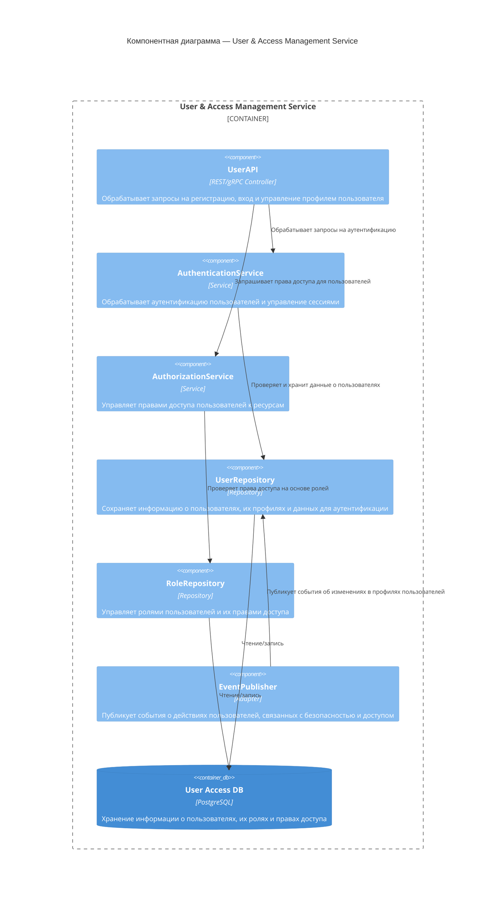
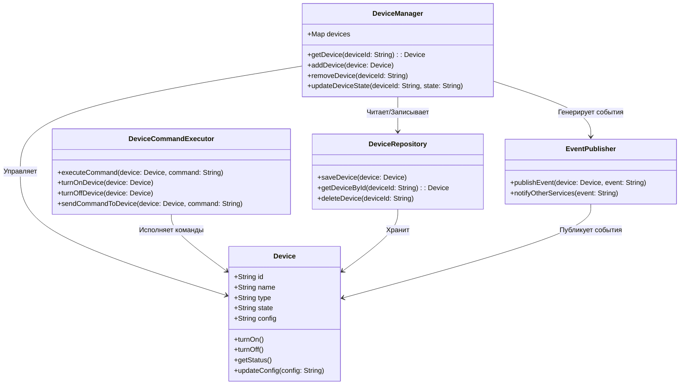
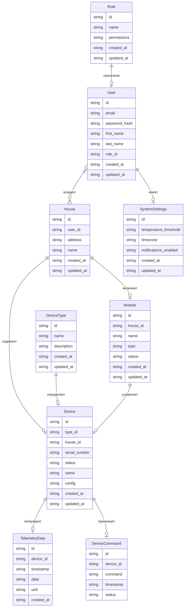

# Project_template

# Задание 1. Анализ и планирование

### 1. Описание функциональности монолитного приложения

**Управление отоплением:**

- Пользователи могут удалённо включать/выключать отопление в своих домах.

**Мониторинг температуры:**

- Пользователи могут просматривать текущую температуру в своих домах через веб-интерфейс.
- Система получает данные о температуре с датчиков, установленных в домах.

### 2. Анализ архитектуры монолитного приложения

- Язык программирования: Java
- База данных: PostgreSQL
- Архитектура: Монолитная, все компоненты системы (обработка запросов, бизнес-логика, работа с данными) находятся в рамках одного приложения.
- Взаимодействие: Синхронное, запросы обрабатываются последовательно.
- Масштабируемость: Ограничена, так как монолит сложно масштабировать по частям.
- Развёртывание: Требует остановки всего приложения.

### 3. Определение доменов и границы контекстов

Домены:
- Управление устройствами
  -  Отправка команд управления отоплением, освещением, воротами и т.п.
  -  Контроль состояния устройств.
- Телеметрия и мониторинг
  - Получение данных от датчиков (температура, движение, состояние устройств).
  - Просмотр истории и текущих значений.
- Модульность и сценарии
  -  Выбор и настройка модулей умного дома.
  -  Конфигурация пользовательских сценариев (автоматизация поведения устройств).
- Подключение устройств
  -  Привязка новых устройств к системе.
  -  Поддержка самостоятельной установки и настройки пользователем.
- Управление пользователями и доступом
  -  Регистрация, авторизация, многопользовательский доступ к дому.
  -  Управление правами и ролями в пределах одного дома или аккаунта.

### **4. Проблемы монолитного решения**

- Синхронная архитектура: Отсутствие асинхронных вызовов и реактивного взаимодействия приводит к низкой производительности при увеличении нагрузки и затрудняет масштабирование.
- Зависимость от выезда специалистов: Подключение датчиков требует физического присутствия специалиста, что является дорогостоящим и неэффективным процессом.
- Ограниченное количество подключений: Текущая система поддерживает только 100 веб-клиентов и 100 модулей управления отоплением. Это недостаточно для целевой экосистемы, которая должна поддерживать множество устройств и пользователей.
- Отсутствие стандартных протоколов: Неподдержка стандартных протоколов усложняет подключение устройств от сторонних производителей, ограничивая выбор пользователей и возможности расширения экосистемы.

### 5. Визуализация контекста системы — диаграмма С4

# Задание 2. Проектирование микросервисной архитектуры

В этом задании вам нужно предоставить только диаграммы в модели C4. Мы не просим вас отдельно описывать получившиеся микросервисы и то, как вы определили взаимодействия между компонентами To-Be системы. Если вы правильно подготовите диаграммы C4, они и так это покажут.

## **Диаграмма контейнеров (Containers)**

## **Диаграмма компонентов (Components)**

### Микросервис управления устройствами (Device Control Service)

### Микросервис телеметрии и мониторинга (Telemetry Service)

### Микросервис модульности и сценариев (Automation Service)

### Микросервис подключения устройств (Device Control Service)

### Микросервис управления пользователями и доступом (User & Access Management Service)

## **Диаграмма кода (Code)**

Добавьте одну диаграмму или несколько.

# Задание 3. Разработка ER-диаграммы

- User: Пользователь имеет связь с домами, которые ему принадлежат, и с настройками системы.

- House: Дом содержит устройства и модули.

- Device: Устройство связано с типом устройства, домом, может генерировать данные телеметрии и принимать команды.

- DeviceType: Тип устройства может быть связан с множеством устройств.

- Module: Модуль связан с домом и может управлять несколькими устройствами.

- TelemetryData: Записи телеметрии генерируются устройствами.

- DeviceCommand: Устройство может получать множество команд.

- Role: Роль пользователя может быть присвоена нескольким пользователям.

- SystemSettings: Каждый пользователь может иметь свои настройки системы.

# ❌ Задание 4. Создание и документирование API

### 1. Тип API

Укажите, какой тип API вы будете использовать для взаимодействия микросервисов. Объясните своё решение.

### 2. Документация API

Здесь приложите ссылки на документацию API для микросервисов, которые вы спроектировали в первой части проектной работы. Для документирования используйте Swagger/OpenAPI или AsyncAPI.